# SEFS — Semantic Entropy File System

## Complete System Documentation

---

## 1. What is SEFS?

SEFS is an **AI-powered file organization system** that automatically reads, understands, and sorts your documents into semantically meaningful folders — in real time. Instead of manually creating folders and dragging files, you simply drop files into a watched directory and SEFS:

1. **Extracts** the text content (PDF or TXT)
2. **Embeds** the text into a 384-dimensional vector using a neural network
3. **Clusters** semantically similar files together using KMeans
4. **Names** each cluster using an LLM (Groq / Llama 3.3 70B)
5. **Organizes** your OS folders to match the semantic structure
6. **Broadcasts** every step live to a React dashboard via WebSocket

> [!IMPORTANT]
> SEFS goes beyond keyword matching — it understands _meaning_. A file about "revenue forecasting" and another about "quarterly earnings" will be grouped together even though they share no keywords, because their _semantic embeddings_ are close in vector space.

---

## 2. High-Level Architecture

```mermaid
graph TB
    subgraph Frontend ["Frontend (React + Vite)"]
        UI["App.jsx — Dashboard UI"]
        WS_HOOK["useWebSocket.js — Real-time hook"]
        CSS["App.css — Dark theme styling"]
    end

    subgraph Backend ["Backend (FastAPI + Python)"]
        MAIN["main.py — API server + orchestrator"]
        WATCHER["watcher.py — File system monitor"]
        EXTRACTOR["extractor.py — PDF/TXT text extraction"]
        EMBEDDER["embedder.py — Chunked AI embedding"]
        CLUSTERER["clusterer.py — KMeans + Groq naming"]
        ORGANISER["organiser.py — OS folder sync"]
        STATE["state.py — In-memory state store"]
    end

    subgraph External ["External Services"]
        GROQ["Groq API — Llama 3.3 70B"]
        SBERT["all-MiniLM-L6-v2 — Sentence Transformer"]
    end

    subgraph Storage ["File System"]
        WATCHED["root/"]
        SEFS_FOLDERS["SEFS_AI Research/\nSEFS_Finance/\nSEFS_Legal/"]
    end

    UI <-->|WebSocket| MAIN
    UI -->|POST /upload| MAIN
    UI -->|GET /open| MAIN
    WS_HOOK --> UI

    MAIN --> WATCHER
    MAIN --> EXTRACTOR
    MAIN --> EMBEDDER
    MAIN --> CLUSTERER
    MAIN --> ORGANISER
    MAIN --> STATE

    WATCHER -->|watches| WATCHED
    ORGANISER -->|creates & moves| SEFS_FOLDERS
    CLUSTERER -->|API call| GROQ
    EMBEDDER -->|inference| SBERT
    EXTRACTOR -->|reads| WATCHED
```



---

## 3. Technology Stack

| Layer                        | Technology                                 | Purpose                                    |
| ---------------------------- | ------------------------------------------ | ------------------------------------------ |
| **Backend Framework**        | FastAPI + Uvicorn                          | Async REST API + WebSocket server          |
| **File Watching**            | Watchdog                                   | OS-level file system event monitoring      |
| **Text Extraction**          | PyMuPDF (fitz)                             | PDF text extraction (up to 10 pages)       |
| **Encoding Detection**       | chardet                                    | Auto-detect TXT file encodings             |
| **AI Embeddings**            | Sentence-Transformers (`all-MiniLM-L6-v2`) | Convert text to 384-dim vectors            |
| **Clustering**               | scikit-learn (KMeans)                      | Group similar embeddings                   |
| **Cluster Evaluation**       | scikit-learn (Silhouette Score)            | Find optimal cluster count                 |
| **Dimensionality Reduction** | UMAP                                       | Project embeddings to 3D for visualization |
| **LLM Naming**               | Groq API (Llama 3.3 70B Versatile)         | Dynamic, content-aware cluster names       |
| **Fallback Naming**          | TF-IDF (scikit-learn)                      | Keyword extraction when LLM unavailable    |
| **Frontend**                 | React 18 + Vite 6                          | Reactive dashboard UI                      |
| **Real-time Comms**          | WebSocket (native)                         | Live activity log + state updates          |
| **Styling**                  | Vanilla CSS, Inter font                    | Dark-mode glassmorphism theme              |

### Python Dependencies (`requirements.txt`)

```
fastapi          — Web framework with WebSocket support
uvicorn          — ASGI server to run FastAPI
watchdog         — Cross-platform file system monitoring
pymupdf          — PDF text extraction (fitz)
chardet          — Character encoding detection
sentence-transformers — Pre-trained embedding models
scikit-learn     — KMeans clustering + TF-IDF + Silhouette
umap-learn       — UMAP dimensionality reduction
numpy            — Vector operations
groq             — Groq Cloud API client
python-multipart — File upload support for FastAPI
```

---

## 4. Data Flow — Step by Step

### 4.1 File Drops into `root/`

```mermaid
sequenceDiagram
    participant User
    participant Watcher as watcher.py
    participant Main as main.py
    participant Extractor as extractor.py
    participant Embedder as embedder.py
    participant Clusterer as clusterer.py
    participant Groq as Groq API
    participant Organiser as organiser.py
    participant State as state.py
    participant Frontend as React UI

    User->>Watcher: Drops file into root/
    Watcher->>Watcher: Debounce (1.5s)
    Watcher->>Main: callback("created", file_path)
    Main->>Main: Acquire pipeline_lock

    Main->>Extractor: extract_text(file_path)
    Extractor-->>Main: raw text (string)

    Main->>Embedder: embed_text(text)
    Note over Embedder: Short text? Embed directly.<br/>Long text? Chunk → batch embed → weighted average
    Embedder-->>Main: 384-dim numpy vector

    Main->>State: Store file data
    Main->>Clusterer: cluster_embeddings(all_embeddings)
    Note over Clusterer: Find optimal K via silhouette score<br/>Run KMeans → assign labels
    Clusterer-->>Main: labels, centers

    Main->>Clusterer: name_all_clusters(cluster_data)
    Clusterer->>Groq: Single batch LLM call
    Note over Groq: "Name these clusters based on content..."
    Groq-->>Clusterer: "AI Research", "Finance Reports"
    Clusterer-->>Main: { 0: "AI Research", 1: "Finance Reports" }

    Main->>Clusterer: sub_cluster_files() [if 4+ files]
    Note over Clusterer: Sub-KMeans → silhouette check<br/>Name sub-clusters via Groq
    Clusterer-->>Main: { "Neural Networks": [0,1], "NLP Papers": [2,3] }

    Main->>Organiser: sync_folders() / sync_nested_folders()
    Organiser->>Organiser: Create SEFS_* folders, move files
    Organiser-->>Main: { old_path: new_path }

    Main->>State: Update file paths
    Main->>Frontend: WebSocket broadcast (graph_update)
    Main->>Frontend: WebSocket broadcast (activity_log_entry)
    Frontend->>Frontend: Re-render dashboard
```



---

## 5. Backend Modules — Deep Dive

### 5.1 `main.py` — The Orchestrator (438 lines)

**Role**: Central hub that wires everything together. Runs the FastAPI server, manages WebSocket connections, and orchestrates the entire pipeline.

**Key Components:**

| Component           | Description                                                        |
| ------------------- | ------------------------------------------------------------------ |
| `app`               | FastAPI instance with CORS middleware (allows all origins for dev) |
| `connected_clients` | List of active WebSocket connections                               |
| `pipeline_lock`     | `threading.Lock` preventing concurrent pipeline runs               |
| `main_loop`         | Reference to asyncio event loop for thread-safe broadcasting       |

**REST Endpoints:**

| Endpoint  | Method    | Purpose                                        |
| --------- | --------- | ---------------------------------------------- |
| `/ws`     | WebSocket | Real-time bidirectional communication          |
| `/graph`  | GET       | Returns current graph state (nodes + clusters) |
| `/health` | GET       | Health check with file/cluster counts          |
| `/logs`   | GET       | Returns recent activity log entries            |
| `/open`   | GET       | Opens a file in the OS default application     |
| `/upload` | POST      | Accepts drag-and-drop file uploads (multipart) |

**Core Functions:**

- **`process_pipeline(event_type, file_path)`** — Entry point from watcher. Acquires lock, then calls `_process_pipeline_locked`.
- **`_process_pipeline_locked(event_type, file_path)`** — Handles created/modified/deleted events. For new files: extracts text → creates embedding → stores in state → triggers recluster.
- **`_recluster_all()`** — The brain of the system:
  1. Collects all embeddings from `state.files`
  2. Runs `cluster_embeddings()` to get labels
  3. Runs `name_all_clusters()` via Groq
  4. Checks each cluster: if 4+ files → runs `sub_cluster_files()` for nested hierarchy
  5. Syncs OS folders via `sync_folders()` or `sync_nested_folders()`
  6. Updates `state.files` with new paths from moves
- **`_apply_moves(moves)`** — Updates in-memory state after the organiser physically moves files on disk.
- **`get_graph_state()`** — Serializes current state into JSON for the frontend (nodes with positions, clusters with sub-clusters).
- **`_process_existing_files()`** — Runs on startup in a background thread. Scans `root/` (including existing `SEFS_*` subdirs up to 2 levels deep), processes all files, then clusters once.
- **`startup()`** — FastAPI startup event. Captures the asyncio event loop, launches file processing and watcher threads.

**Threading Model:**

```
Main Thread (asyncio)     →  FastAPI + WebSocket handling
Background Thread 1       →  _process_existing_files() on startup
Background Thread 2       →  Watchdog Observer (file monitoring)
Timer Threads (per file)  →  Debounce timers from watcher
```

All pipeline work is serialized through `pipeline_lock` to prevent race conditions.

---

### 5.2 `extractor.py` — Text Extraction (58 lines)

**Role**: Extracts clean text from PDF and TXT files. Never crashes the pipeline — always returns a string (empty on failure).

**Functions:**

| Function                    | Input             | Output                | Details                                                                                        |
| --------------------------- | ----------------- | --------------------- | ---------------------------------------------------------------------------------------------- |
| `extract_text(file_path)`   | File path string  | Extracted text string | Routes to PDF or TXT handler based on extension                                                |
| `_extract_pdf(file_path)`   | PDF path          | Cleaned text          | Uses PyMuPDF (fitz). Reads first **10 pages** max. Joins all page text, strips whitespace.     |
| `_extract_txt(file_path)`   | TXT path          | Raw text              | Reads file in binary mode, auto-detects encoding via `chardet`, decodes with error replacement |
| `get_snippet(text, length)` | Text + max length | Preview string        | Returns first ~200 chars, breaking at word boundary, appending "..."                           |

**Supported Formats:**

- `.pdf` — Processed via PyMuPDF (handles scanned text, multi-column layouts)
- `.txt` — Processed with auto-encoding detection (UTF-8, Latin-1, Windows-1252, etc.)

---

### 5.3 `embedder.py` — Chunked AI Embedding (98 lines)

**Role**: Converts text of any length into a fixed 384-dimensional vector that captures the document's semantic meaning.

**Model**: `all-MiniLM-L6-v2` (loaded once on startup, cached globally)

- 22M parameters, 384-dim output
- Trained on 1B+ sentence pairs
- Fast inference even on CPU

**The Chunking Strategy (essential for large files):**


**Configuration:**

- `CHUNK_SIZE = 500` chars per chunk
- `MAX_CHUNKS = 20` max chunks per file (~10,000 chars coverage)

**Why weighted averaging?**
Early chunks (introduction, abstract) typically contain the most important topic indicators. The weight formula `1.0 / (1 + 0.1 * i)` gives:

- Chunk 0: weight 1.00
- Chunk 1: weight 0.91
- Chunk 5: weight 0.67
- Chunk 19: weight 0.33

This ensures the beginning of the document has ~3× the influence of the end, matching how documents are typically structured.

**`_split_into_chunks(text)`:**

1. Splits text at sentence boundaries (`.!?` followed by whitespace)
2. Accumulates sentences into chunks up to `CHUNK_SIZE`
3. If a single sentence exceeds `CHUNK_SIZE`, splits it by words
4. Filters out chunks shorter than 20 characters
5. Returns at most `MAX_CHUNKS` chunks

---

### 5.4 `clusterer.py` — Clustering + LLM Naming (387 lines)

**Role**: Groups file embeddings into semantic clusters, then names them using Groq (Llama 3.3 70B) with TF-IDF fallback.

**Key Functions:**

#### `find_optimal_clusters(embeddings, max_k=8) → int`

Automatically determines the best number of clusters:

- `n ≤ 2` → returns 1 (too few files to cluster)
- `n ≤ 4` → returns 2
- Otherwise: tries K=2 through K=min(8, n-1), picks the K with highest **silhouette score**

**Silhouette score** measures how similar each point is to its own cluster vs the nearest neighbor cluster. Range: -1 (wrong cluster) to +1 (perfect separation).

#### `cluster_embeddings(embeddings, n_clusters=None) → (labels, centers)`

Runs KMeans clustering with `n_init=10` (10 random initializations, picks the best).

#### `name_all_clusters(cluster_data) → { id: "Name" }`

**Primary path (Groq):**

1. For each cluster, takes up to 3 files' text
2. Applies `_smart_truncate()` — keeps 60% from start + 40% from end (captures intro AND conclusion)
3. Sends a single prompt to `llama-3.3-70b-versatile` asking for 2-3 word names
4. Parses response line by line
5. Fills any missing names with TF-IDF fallback

**Fallback path (TF-IDF):**
If Groq fails, uses TF-IDF to extract distinctive terms per cluster.

#### `sub_cluster_files(file_paths, embeddings, texts, file_names, min_files=4) → dict | None`

**Hierarchical sub-clustering** for large clusters:

1. Only triggers if cluster has ≥ 4 files
2. Tries K=2 through K=4, picks best silhouette score
3. Only proceeds if `best_score > 0.1` (meaningful separation exists)
4. Builds sub-cluster data and names via `_name_sub_clusters_groq()`
5. Returns `{ "Sub Name": [file_indices] }`

#### `_smart_truncate(text, max_chars=300) → str`

Intelligent truncation for LLM prompts:

- Short text (≤ max_chars): returned as-is
- Long text: keeps first 60% + last 40%, joined by " ... "
- This captures both the **introduction** AND the **conclusion** of long documents

#### `get_3d_positions(embeddings) → [[x,y,z], ...]`

Projects 384-dim embeddings to 3D using UMAP for visualization. Normalizes to [-5, 5] range.

---

### 5.5 `watcher.py` — File System Monitor (103 lines)

**Role**: Watches `root/` for file changes and triggers the pipeline. Uses debouncing to prevent duplicate processing.

**Class: `SEFSEventHandler`**

| Method                              | Purpose                                                                                       |
| ----------------------------------- | --------------------------------------------------------------------------------------------- |
| `_should_ignore(path)`              | Filters out: directories, files inside `SEFS_*` folders, hidden files, unsupported extensions |
| `_schedule(event_type, path)`       | Debounces events — waits 1.5s of inactivity before processing                                 |
| `_fire(event_type, path)`           | Actually calls `process_pipeline()` after debounce                                            |
| `on_created/modified/deleted/moved` | Watchdog event handlers → route to `_schedule()`                                              |

**Why debouncing?**
When you save a file, the OS often fires multiple events (created → modified → modified). Without debouncing, the pipeline would run 3 times. The 1.5s timer ensures we only process once, after the file is fully written.

**Why ignore `SEFS_*` directories?**
When the organiser moves a file into `SEFS_Finance/`, the watcher detects this as a "delete" from root and a "create" in `SEFS_Finance/`. Without filtering, this would create an infinite loop. By ignoring events inside `SEFS_*` folders, we break the cycle.

```
root/
├── report.pdf          ← Watcher MONITORS this
├── SEFS_Finance/       ← Watcher IGNORES events here
│   └── report.pdf
└── SEFS_AI Research/   ← Watcher IGNORES events here
    └── paper.pdf
```

---

### 5.6 `organiser.py` — OS Folder Synchronization (141 lines)

**Role**: Creates and manages the actual OS folder structure to match cluster assignments.

**Functions:**

#### `sync_folders(root, cluster_map) → moves`

Flat folder sync:

1. For each cluster name, creates `SEFS_<ClusterName>/` directory
2. Moves each file into its assigned folder (skips if already there)
3. Handles naming conflicts (appends `_1`, `_2`, etc.)
4. Cleans up empty or orphaned `SEFS_*` folders (moves files back to root first, then removes empty dir)
5. Returns `{ old_path: new_path }` dict for state updates

#### `sync_nested_folders(root, nested_map) → moves`

Hierarchical folder sync:

1. Creates `SEFS_<ParentCluster>/<SubCluster>/` directories
2. Moves files into their sub-cluster folders
3. Returns `{ old_path: new_path }`

**Result structure:**

```
root/
├── SEFS_AI Research/
│   ├── Neural Networks/
│   │   ├── cnn_paper.pdf
│   │   └── rnn_notes.txt
│   └── NLP Papers/
│       ├── transformer.pdf
│       └── bert_analysis.txt
├── SEFS_Finance/
│   ├── budget_q3.pdf
│   └── revenue_report.txt
└── SEFS_Legal/
    └── contract_draft.pdf
```

#### `build_cluster_map(root, assignments, cluster_names) → cluster_map`

Utility: converts `{ file_path: cluster_id }` + `{ cluster_id: "Name" }` into `{ "Name": [file_paths] }`.

---

### 5.7 `state.py` — In-Memory State Store (49 lines)

**Role**: Centralized global state. All modules read/write from here.

**Data Structures:**

```python
files = {}
# { file_path: {
#     "name": "report.pdf",
#     "path": "/full/path/report.pdf",
#     "text": "extracted full text...",
#     "embedding": np.array([...384 dims...]),
#     "snippet": "First 200 chars...",
#     "cluster_id": 0,
#     "sub_cluster": "Neural Networks" or None,
#     "position_3d": [x, y, z],
#     "word_count": 1523,
# }}

clusters = {}
# { cluster_id: {
#     "id": 0,
#     "name": "AI Research",
#     "color": "#00f5a0",
#     "file_count": 4,
#     "sub_clusters": { "Neural Networks": {...}, "NLP Papers": {...} } or None,
# }}

activity_log = deque(maxlen=50)
# Each entry: { "timestamp", "time_str", "type", "message", "icon" }
```

**Cluster Colors** — 8-color palette:
| Color | Hex | Usage |
|-------|-----|-------|
| Mint green | `#00f5a0` | Cluster 0 |
| Purple | `#7b61ff` | Cluster 1 |
| Coral red | `#ff6b6b` | Cluster 2 |
| Yellow | `#ffd93d` | Cluster 3 |
| Teal | `#4ecdc4` | Cluster 4 |
| Orange | `#ff9f43` | Cluster 5 |
| Lavender | `#a29bfe` | Cluster 6 |
| Pink | `#fd79a8` | Cluster 7 |

Colors cycle via `cluster_id % 8`.

---

## 6. Frontend — Deep Dive

### 6.1 Stack

- **React 18** — UI library
- **Vite 6** — Dev server + bundler (HMR)
- **Vanilla CSS** — Dark-mode theme with Inter font

### 6.2 `useWebSocket.js` — Real-Time Hook (51 lines)

Custom React hook that manages the WebSocket connection:

```
connect() → ws.onopen (set connected=true)
           → ws.onmessage:
               "graph_update"       → setGraphData(nodes, clusters)
               "activity_log"       → setLogs(full dump)
               "activity_log_entry" → append single entry (cap at 50)
           → ws.onclose → auto-reconnect after 2s
```

**Returns:** `{ graphData, logs, connected }`

On initial connection, the backend sends:

1. Full `graph_update` with current state
2. Full `activity_log` dump of recent events

After that, incremental `activity_log_entry` messages stream in real-time.

### 6.3 `App.jsx` — Dashboard UI (285 lines)

**Sections (top to bottom):**

| Section                           | Description                                                                                                                                  |
| --------------------------------- | -------------------------------------------------------------------------------------------------------------------------------------------- |
| **Drag Overlay**                  | Full-screen overlay when files are dragged over the window                                                                                   |
| **Header**                        | Logo + "● Live" connection badge                                                                                                             |
| **Stats Row**                     | 3 cards: Files Tracked, Semantic Clusters, Total Words Analyzed                                                                              |
| **Pipeline Banner**               | Visual flow: File Dropped → Text Extracted → AI Embedding → Clustered → Folder Created                                                       |
| **Upload Zone**                   | Click or drag to upload `.pdf` / `.txt` files                                                                                                |
| **Left Column: Clusters**         | Cluster cards with color dots, names, file counts. Files are clickable (opens via `/open` endpoint). Sub-clusters render as indented groups. |
| **Left Column: Content Previews** | Snippet cards showing first 200 chars of each file, colored by cluster                                                                       |
| **Right Column: Activity Log**    | Scrollable, color-coded event log with timestamps. Auto-scrolls to latest entry.                                                             |

**File Upload Flow:**

1. User drops files or clicks upload zone
2. `FormData` is sent to `POST /upload`
3. Backend saves to `root/`, watcher picks them up
4. Pipeline processes automatically
5. UI updates via WebSocket

**Sub-Cluster Rendering:**
When a cluster has `sub_clusters`, the file list is grouped:

```
📁 AI Research (4 files)
  └─ 🟢 Neural Networks (2)
       📕 cnn_paper.pdf — 1,523 words
       📄 rnn_notes.txt — 892 words
  └─ 🟢 NLP Papers (2)
       📕 transformer.pdf — 2,105 words
       📄 bert_analysis.txt — 1,340 words
```

### 6.4 `App.css` — Styling (415 lines)

Dark-mode design system:

- **Background**: `#0a0a12` (deep navy)
- **Surfaces**: `#12121e` (slightly lighter)
- **Accent**: `#00f5a0` (mint green)
- **Font**: Inter (Google Fonts)
- **Radius**: 12px
- Log entries are color-coded by type (detect=purple, extract=blue, embed=yellow, cluster=green, etc.)
- Responsive breakpoint at 900px (single column on mobile)

---

## 7. How Token Limits Are Handled

### The Problem

Large files (1000+ lines) can contain 50,000+ characters. Feeding this directly to either the embedding model or the LLM would exceed token limits and waste compute.

### The Solution — Three Layers

| Layer          | Component      | Strategy                                                                                  | Limit                                          |
| -------------- | -------------- | ----------------------------------------------------------------------------------------- | ---------------------------------------------- |
| **Extraction** | `extractor.py` | PDFs capped at 10 pages                                                                   | ~5,000 words                                   |
| **Embedding**  | `embedder.py`  | Chunked: split into 500-char chunks at sentence boundaries, batch embed, weighted average | 20 chunks × 500 chars = 10,000 chars           |
| **LLM Naming** | `clusterer.py` | `_smart_truncate()`: keeps 60% from start + 40% from end, max 300 chars per file          | 3 files × 300 chars × 8 clusters ≈ 7,200 chars |

**Total prompt to Groq = ~7,200 chars ≈ 1,800 tokens** (well within the 8,192 token context limit of `llama-3.3-70b-versatile`).

---

## 8. Error Handling & Resilience

| Scenario                                 | How SEFS Handles It                                      |
| ---------------------------------------- | -------------------------------------------------------- |
| PDF extraction fails                     | Returns empty string, logs warning, skips file           |
| Encoding detection fails                 | Falls back to UTF-8 with error replacement               |
| Groq API down                            | Falls back to TF-IDF keyword extraction for naming       |
| Groq rate limited                        | Falls back to TF-IDF (no crash)                          |
| File moved by organiser triggers watcher | `_should_ignore()` filters out SEFS\_\* directory events |
| Rapid file saves                         | 1.5s debounce prevents duplicate processing              |
| Concurrent pipeline calls                | `pipeline_lock` serializes all processing                |
| WebSocket client disconnects             | Removed from `connected_clients`, no error               |
| WebSocket send fails                     | Client added to dead list, removed from pool             |
| File naming conflicts                    | Appends `_1`, `_2`, etc. to destination filename         |
| Empty text extracted                     | Logs warning with ⚠️ icon, skips file                    |

---

## 9. Project File Structure

```
sefs/
├── backend/
│   ├── main.py            — FastAPI server + pipeline orchestrator (438 lines)
│   ├── extractor.py       — PDF/TXT text extraction (58 lines)
│   ├── embedder.py        — Chunked AI embedding (98 lines)
│   ├── clusterer.py       — KMeans clustering + Groq naming (387 lines)
│   ├── watcher.py         — File system monitor with debounce (103 lines)
│   ├── organiser.py       — OS folder creation + file moves (141 lines)
│   ├── state.py           — Global in-memory state store (49 lines)
│   └── requirements.txt   — Python dependencies (11 packages)
│
├── frontend/
│   ├── src/
│   │   ├── App.jsx        — Main dashboard component (285 lines)
│   │   ├── App.css        — Dark-mode theme styling (415 lines)
│   │   ├── main.jsx       — React entry point (9 lines)
│   │   └── hooks/
│   │       └── useWebSocket.js — Real-time WebSocket hook (51 lines)
│   ├── package.json       — Frontend dependencies
│   └── index.html         — HTML entry point
│
└── root/                  — Drop files here
    ├── SEFS_AI Research/
    ├── SEFS_Finance/
    └── SEFS_Legal/
```

---

## 10. How to Run

### Backend

```bash
cd sefs/backend
pip install -r requirements.txt
python main.py
# Server starts on http://localhost:8000
```

### Frontend

```bash
cd sefs/frontend
npm install
npm run dev
# Dev server starts on http://localhost:5173
```

### Environment Variables (Optional)

```
GROQ_API_KEY=gsk_...   # Groq API key (has fallback hardcoded for dev)
```

---

## 11. API Reference

### WebSocket `/ws`

**On connect, server sends:**

```json
{ "type": "graph_update", "nodes": [...], "clusters": [...], "total_files": 7 }
{ "type": "activity_log", "logs": [...] }
```

**On state change, server sends:**

```json
{ "type": "graph_update", "nodes": [...], "clusters": [...], "total_files": 7 }
```

**On new event, server sends:**

```json
{ "type": "activity_log_entry", "entry": { "timestamp": 1707..., "time_str": "21:15:03", "type": "cluster", "message": "Cluster: AI Research (3 files)", "icon": "📁" } }
```

### Node Schema

```json
{
  "id": "D:\\path\\to\\file.pdf",
  "name": "file.pdf",
  "snippet": "First 200 chars of content...",
  "word_count": 1523,
  "cluster_id": 0,
  "cluster_name": "AI Research",
  "sub_cluster": "Neural Networks",
  "color": "#00f5a0",
  "position": [1.2, -3.4, 5.6]
}
```

### Cluster Schema

```json
{
  "id": 0,
  "name": "AI Research",
  "color": "#00f5a0",
  "file_count": 4,
  "sub_clusters": [
    { "name": "Neural Networks", "file_count": 2 },
    { "name": "NLP Papers", "file_count": 2 }
  ]
}
```

### REST Endpoints

| Endpoint         | Method | Body                               | Response                           |
| ---------------- | ------ | ---------------------------------- | ---------------------------------- |
| `/graph`         | GET    | —                                  | `{ nodes, clusters, total_files }` |
| `/health`        | GET    | —                                  | `{ status, files, clusters }`      |
| `/logs`          | GET    | —                                  | `{ logs: [...] }`                  |
| `/open?path=...` | GET    | —                                  | `{ status: "opened" }`             |
| `/upload`        | POST   | `multipart/form-data` with `files` | `{ status, uploaded, count }`      |
