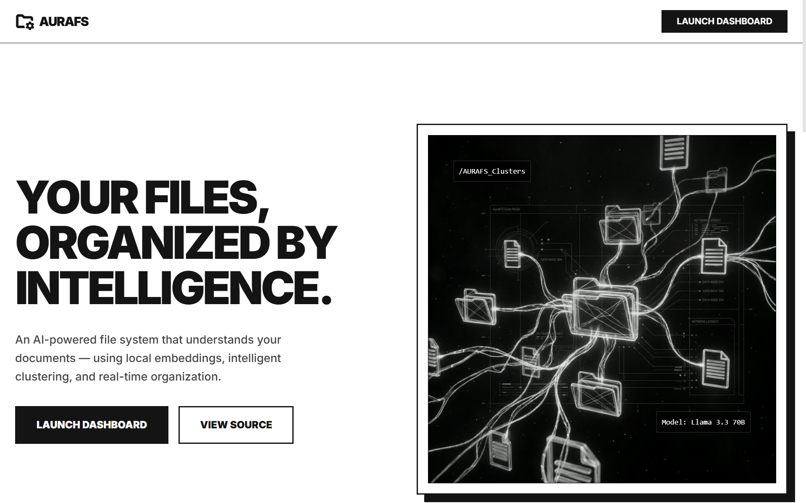
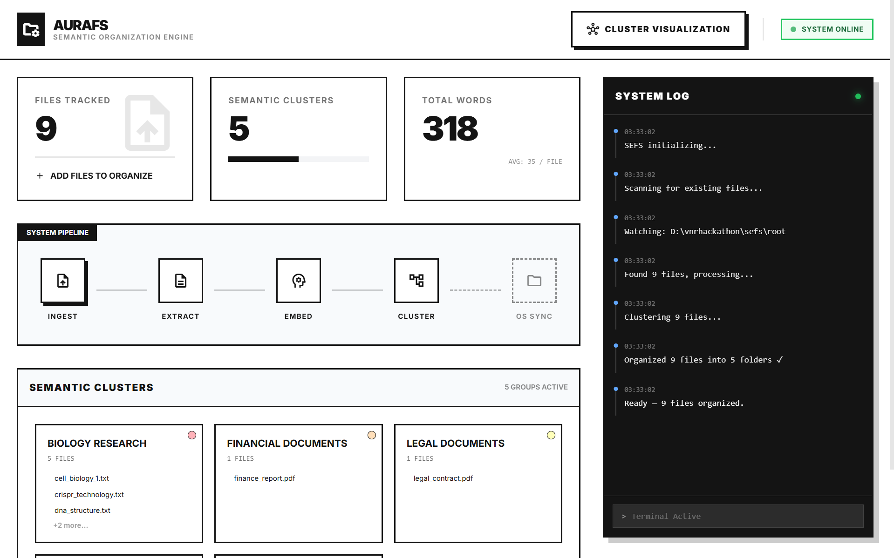
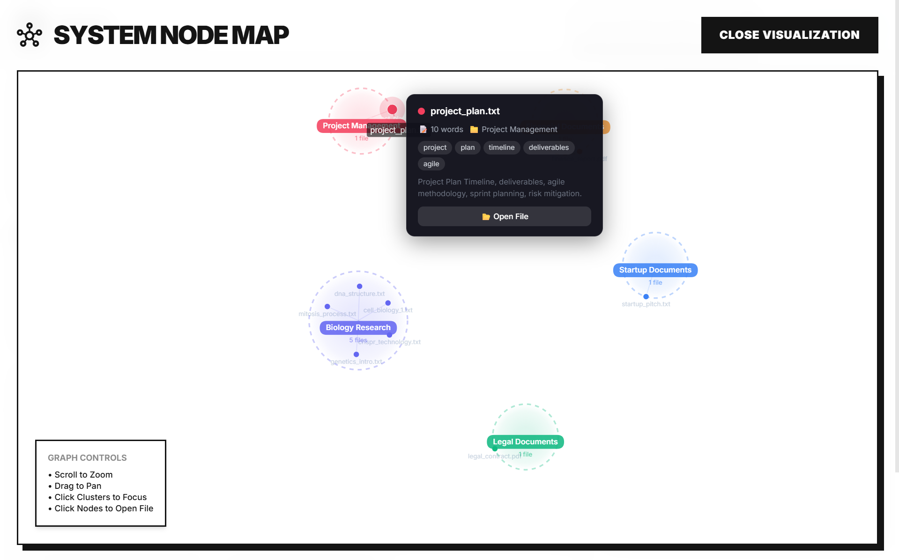

<p align="center">
  <h1 align="center">🧠 AuraFS — Semantic Entropy File System</h1>
  <p align="center">
    <strong>AI-Powered Intelligent File Organization</strong><br/>
    <em>Drop files. Watch them organize themselves.</em>
  </p>
</p>

<p align="center">
  
  
  
  
  
</p>

---

## ❌ The Problem

We all have hundreds — sometimes thousands — of files dumped into Downloads, Desktop, or shared drives. Finding anything means scrolling, searching, or giving up. Traditional solutions rely on **manual folder creation** or **keyword-based rules** that break the moment a file doesn't match a rigid pattern.

> 📂 *"Was that report in `Q3 Reports`, `Finance`, or `Client Docs`?"*

**The core issues:**

- **Manual sorting doesn't scale** — humans can't keep up with the volume of files they generate and receive daily.
- **Keyword/rule-based tools are brittle** — they fail on synonyms, context, and novel topics. A file about "quarterly earnings" won't match a rule looking for "revenue."
- **No semantic understanding** — existing tools see filenames and extensions, not *meaning*. Two documents about the same topic with different titles stay separated forever.
- **No visibility** — once files are sorted (manually or by scripts), there's no way to see *how* they relate to each other.

---

## ✅ Our Solution — AuraFS

AuraFS treats file organization as a **machine learning problem**, not a string-matching one.

Instead of rigid rules, AuraFS **reads your documents**, converts them into **semantic vectors** (numerical representations of meaning), and uses **clustering algorithms** to group files that are *about the same thing* — regardless of what they're named.

**How we defend this approach:**

| Traditional Approach | AuraFS Approach |
|---------------------|-----------------|
| Manual folder creation | Automatic — folders create themselves |
| Keyword matching ("invoice" → Finance/) | Semantic understanding — meaning, not words |
| Breaks on new/unknown topics | KMeans discovers novel clusters automatically |
| Static — organize once, forget | Real-time — new files organized in seconds |
| No insight into file relationships | Interactive graph visualization of clusters |
| Cloud-dependent, privacy risk | Embeddings are 100% local — files never leave your machine |

**The pipeline in one sentence:**

> Drop a file → AuraFS **extracts** text → **embeds** it into a 384-dim vector → **clusters** it with similar files → **creates an OS folder** → **streams it live** to your dashboard.

The result: files about "quantum mechanics" and "particle physics" land in the same folder — even if neither filename contains those words — because their *meanings* are close in vector space.

---

## 📸 Demo

### Landing Page
<p align="center">
  
</p>

### Live Dashboard — Real-Time File Organization
<p align="center">
  
</p>

### Semantic Graph — Cluster Visualization
<p align="center">
  
  
</p>


---

## 💡 What is AuraFS?

AuraFS is an **AI-powered file organization system** that reads, understands, and sorts your documents into semantically meaningful folders — **in real time**.

Drop files into a directory → AuraFS **extracts** text → **embeds** meaning into vectors → **clusters** similar files → **creates OS folders** → **streams updates** to a live dashboard.

> AuraFS understands *meaning*, not just keywords. "Revenue forecasting" and "quarterly earnings" get grouped together because their semantic embeddings are close in vector space.

---

## ✨ Features

| | Feature | Description |
|---|---------|-------------|
| 🔒 | **Privacy-First** | Embeddings run 100% locally — files never leave your machine |
| ⚡ | **Real-Time** | File watcher → organized in seconds |
| 🎯 | **Hybrid Clustering** | Keyword-first (30+ categories) + KMeans for unknowns |
| 🤖 | **LLM Naming** | Groq Llama 3.3 70B with TF-IDF fallback |
| 📊 | **Live Graph** | Interactive force-directed cluster visualization |
| 📁 | **OS Integration** | Creates real `SEFS_*` folders — not virtual |
| 🔄 | **WebSocket** | Every pipeline step streams live |
| 📤 | **Drag & Drop** | Upload via web UI or drop into folder |

---

## 🏗 Architecture

```
┌─────────────────────────────────────────────────────────────────────────┐
│                              FRONTEND                                   │
│                                                                         │
│   LandingPage.jsx ──── App.jsx ──── Dashboard.jsx ──── Graph2D.jsx     │
│                                          │                              │
│                                   useWebSocket.js                       │
│                                          │                              │
├──────────────────────────────── WebSocket ┼──────────────────────────────┤
│                                          │                              │
│                                     main.py            BACKEND          │
│                                   Orchestrator                          │
│                                    ╱  │  ╲                              │
│                          ┌────────╱   │   ╲────────┐                    │
│                          │            │            │                    │
│                      watcher.py   embedder.py  clusterer.py             │
│                      (watchdog)   (MiniLM-L6)  (KMeans+Groq)           │
│                          │            │            │                    │
│                      extractor.py  state.py    organiser.py             │
│                      (PyMuPDF)     (in-mem)    (OS folders)             │
│                                                                         │
├─────────────────────────────────────────────────────────────────────────┤
│  EXTERNAL:  Sentence-Transformers (LOCAL)  │  Groq API (optional)      │
└─────────────────────────────────────────────────────────────────────────┘
```

---

## 🔄 Pipeline

```
  ┌─────────┐    ┌─────────┐    ┌─────────┐    ┌──────────┐    ┌─────────┐    ┌──────────┐
  │ DETECT  │───▶│ EXTRACT │───▶│  EMBED  │───▶│ CLUSTER  │───▶│  SYNC   │───▶│BROADCAST │
  │         │    │         │    │         │    │          │    │         │    │          │
  │ watcher │    │extractor│    │embedder │    │clusterer │    │organiser│    │ main.py  │
  │   .py   │    │  .py    │    │  .py    │    │  .py     │    │  .py    │    │          │
  └─────────┘    └─────────┘    └─────────┘    └──────────┘    └─────────┘    └──────────┘
   Watchdog       PDF/TXT        384-dim         Hybrid:        SEFS_*         WebSocket
   3s debounce    auto-encode    vectors       keywords →      OS folders     real-time
                                              KMeans fallback
```

### Hybrid Clustering — The Core Innovation

```
                    ┌─────────────────────────┐
                    │     N files + text       │
                    └────────┬────────────────┘
                             │
                    ┌────────▼────────────────┐
                    │  PHASE A: Keywords       │   Deterministic
                    │  30+ categories          │   500+ keywords
                    │  filename weighted 3×    │   word-boundary regex
                    └────────┬────────────────┘
                             │
                 ┌───────────┴───────────┐
                 │                       │
          ┌──────▼──────┐       ┌────────▼───────┐
          │  Matched    │       │  Unmatched     │
          │  → Category │       │  → KMeans      │
          │  groups     │       │  + silhouette  │
          └──────┬──────┘       │  + Groq/TF-IDF │
                 │              └────────┬───────┘
                 │                       │
                 └───────────┬───────────┘
                             │
                    ┌────────▼────────────────┐
                    │  PHASE C: De-duplicate   │
                    │  Merge → Final clusters  │
                    └─────────────────────────┘
```

---

## 🛠 Tech Stack

| Layer | Technology | Why |
|-------|-----------|-----|
| **Server** | FastAPI + Uvicorn | Async REST + WebSocket |
| **File Watch** | Watchdog | OS-level monitoring with debounce |
| **Extraction** | PyMuPDF + chardet | PDF (10 pages) + auto-encoding TXT |
| **Embeddings** | all-MiniLM-L6-v2 | 384-dim local vectors, chunked for long files |
| **Clustering** | KMeans + Silhouette | Optimal K detection |
| **Naming** | Groq Llama 3.3 70B | LLM → TF-IDF → filename fallback chain |
| **Projection** | PCA / UMAP | 384-dim → 3D for visualization |
| **Frontend** | React 18 + Vite 6 | Fast HMR + reactive UI |
| **Graph** | react-force-graph-2d | Interactive cluster visualization |
| **Styling** | Tailwind CSS 3 | Utility-first styling |
| **Comms** | WebSocket | Real-time streaming |

---

## 📁 Project Structure

```
sefs/
├── .env                         ← API keys (gitignored)
├── .gitignore
├── README.md
├── ARCHITECTURE.md              ← Deep technical docs
│
├── backend/
│   ├── main.py                  ← FastAPI server + pipeline orchestrator
│   ├── extractor.py             ← PDF/TXT text extraction
│   ├── embedder.py              ← Chunked AI embedding (all-MiniLM-L6-v2)
│   ├── clusterer.py             ← Hybrid clustering + Groq naming
│   ├── watcher.py               ← File system monitor (3s debounce)
│   ├── organiser.py             ← OS folder sync + file moves
│   ├── state.py                 ← Global in-memory state
│   ├── generate_test_data.py    ← Test file generator (11 files)
│   └── requirements.txt        ← Python dependencies
│
├── frontend/
│   └── src/
│       ├── App.jsx              ← Router (Landing + Dashboard)
│       ├── LandingPage.jsx      ← Landing page
│       ├── Dashboard.jsx        ← Dashboard (stats, clusters, logs, upload)
│       ├── components/
│       │   └── Graph2D.jsx      ← 2D force graph with tooltips
│       └── hooks/
│           └── useWebSocket.js  ← WebSocket with auto-reconnect
│
├── screenshots/                 ← Demo images
│
└── root/                        ← Drop files here!
    └── SEFS_*/                  ← Auto-created organized folders
```

---

## 🚀 Getting Started

### Prerequisites

- **Python 3.10+** · **Node.js 18+** · **Groq API Key** (optional)

### Setup

```bash
# 1. Backend
cd sefs/backend
pip install -r requirements.txt

# 2. Frontend
cd ../frontend
npm install

# 3. API Key (optional — create .env in project root)
echo "GROQ_API_KEY=gsk_your_key_here" > ../.env
```

> Without a Groq key, AuraFS uses TF-IDF for cluster naming — still works perfectly.

### Run

```bash
# Terminal 1 — Backend (http://localhost:8000)
cd sefs/backend
python main.py

# Terminal 2 — Frontend (http://localhost:5173)
cd sefs/frontend
npm run dev
```

### Try It

1. Open **http://localhost:5173** → **Launch Dashboard**
2. Drop `.pdf` or `.txt` files into `root/` or drag onto the web UI
3. Watch files get analyzed and organized in real-time!

```bash
# Or generate test data
cd sefs/backend
python generate_test_data.py   # Creates 11 physics + biology files
```

---

## 📡 API

| Endpoint | Method | Purpose |
|----------|--------|---------|
| `/ws` | WebSocket | Real-time state + activity streaming |
| `/graph` | GET | Current graph state (files + clusters) |
| `/upload` | POST | Upload files (multipart) |
| `/open?path=...` | GET | Open file in OS default app |
| `/health` | GET | Status check |
| `/logs` | GET | Recent activity log |

---

## 🛡 Resilience

| Scenario | Handling |
|----------|----------|
| Groq API down | TF-IDF fallback for naming |
| PDF extraction fails | Skips file, never crashes |
| Rapid file saves | 3s debounce prevents duplicates |
| Many files at once | 5s batch window before clustering |
| Organiser triggers watcher | SEFS_* folders ignored + path pre-marking |
| Concurrent pipeline calls | Thread lock serializes all work |
| WebSocket drops | Auto-reconnect with exponential backoff |

---

### Team

**It Works On My Machine**

### TeamLead

**Pardha Saradhi(Pardhu)**

### What Makes AuraFS Unique

1. **Hybrid Clustering** — Keyword classification + unsupervised KMeans. Precise for known domains, flexible for novel topics.
2. **Privacy-First** — Embeddings are 100% local. Only cluster naming optionally uses cloud, with full offline fallback.
3. **Real Folders** — Creates actual OS directories. Close the app → files stay organized.
4. **Live Visualization** — Every pipeline step visible in real-time via WebSocket + interactive force graph.

```
Backend:   Python 3.10+ │ FastAPI │ Sentence-Transformers │ KMeans │ Groq
Frontend:  React 18 │ Vite 6 │ Tailwind CSS │ react-force-graph-2d
ML:        all-MiniLM-L6-v2 (local) │ KMeans + Silhouette │ PCA/UMAP
```

---

<p align="center">
  <strong>AuraFS</strong> — Let your files organize themselves. 🧠📁
</p>
